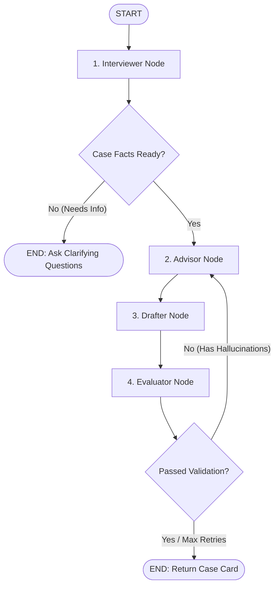

# ⚖️ LawAI — AI-Powered Legal Assistant & Document Drafter

LawAI is a premium, full-stack monorepo application designed to act as an automated legal aid assistant. It conducts interactive legal interviews, performs multi-lingual text-to-speech (TTS), collects structured case facts, and drafts formal legal demand notices.

---

## 🚀 Key Features

*   **🎙️ Multilingual Interactive Legal Interview**: A conversational AI agent that guides clients through an intake process, automatically asking clarifying questions based on the case facts.
*   **🗣️ Auto-Language Detection & TTS**: Integrates standard WebSpeech API voices for Hindi (`hi-IN`), Malayalam (`ml-IN`), and Indian English (`en-IN`) with browser voice binding fallback.
*   **📄 Formal Legal Notice Generation**: Extracts structured case facts into a premium preview modal where users can inspect and copy a drafted legal demand notice to their clipboard.
*   **🔒 Secure JWT Authentication**: User register/login modules protect data, storing chat histories securely in MongoDB.
*   **✨ Premium Glassmorphic UI**: High-fidelity dark mode with modern typography (Outfit/Inter), clean CSS transitions, responsive grids, and interactive elements.

---

## 🛠️ Tech Stack

### Frontend
- **Framework**: React.js (Vite)
- **Styling**: Vanilla CSS + Tailwind CSS v4.0 (for layout utilities)
- **Libraries**: `lucide-react` (icons), `react-markdown` & `remark-gfm` (rich document rendering)

### Backend
- **Server**: Node.js + Express.js (ES Modules)
- **Database**: MongoDB + Mongoose (stores users and chat sessions)
- **Authentication**: JSON Web Token (JWT) & bcryptjs (password hashing)

### AI & Model Layer
- **Model Server**: Google Gemma / LLM Pipeline notebook (`Model/gemmahack.ipynb`) served via an ngrok proxy (`MODEL_API_URL`).

---

## 📂 Repository Structure

```
LawAI/
├── Backend/                 # Express REST API Server
│   ├── src/
│   │   ├── middleware/      # JWT auth guard
│   │   ├── models/          # Mongoose Schemas (User, Chat)
│   │   └── routes/          # API router (auth, chat, notices)
│   ├── server.js            # Express entrypoint
│   └── .env                 # Backend environment configs
│
├── Frontend/                # Vite React App
│   ├── src/
│   │   ├── components/      # ChatBubble, headers, loading states
│   │   ├── pages/           # ChatView, Landing, Features, Auth
│   │   ├── context/         # AuthContext state provider
│   │   └── index.css        # Core custom layout & design system
│   └── .env                 # Frontend environment configs
│
├── Model/                   # AI Inference layer
│   └── gemmahack.ipynb      # Kaggle/Colab LLM pipeline notebook
│
└── package.json             # Root monorepo scripts config
```

---

## ⚙️ Setup and Installation

### Prerequisites
- [Node.js](https://nodejs.org/) (v18+ recommended)
- [MongoDB Atlas](https://www.mongodb.com/cloud/atlas) or a running local MongoDB instance

### 1. Clone & Install Dependencies
From the root of the project:
```bash
# Install all dependencies across both Backend and Frontend directories
npm run install-all
```

### 2. Configure Environment Variables

#### Backend Configuration
Create a `.env` file in the `Backend/` directory:
```env
PORT=5001
MONGODB_URI=your_mongodb_connection_string
JWT_SECRET=your_jwt_signing_secret
MODEL_API_URL=your_ngrok_model_server_url
```

#### Frontend Configuration
Create a `.env` file in the `Frontend/` directory:
```env
VITE_API_URL=http://localhost:5001
```

### 3. Running the Application
To run the full stack (both frontend and backend) simultaneously with a single command:
```bash
npm run dev
```
This script leverages `concurrently` to launch:
- The **Backend Server** on `http://localhost:5001`
- The **Vite Development Server** on `http://localhost:5173`

---

## 🧠 AI Model & LangGraph Pipeline

The core intelligence of LawAI runs on a **Google Gemma** model orchestrated via a multi-agent **LangGraph** state workflow. It is designed to safely handle citizen intake, retrieve verified laws, and evaluate its own output to eliminate hallucinations.

### 1. State Workflow Architecture
The pipeline uses a structured state (`AgentState`) containing conversation context, extracted structured facts, retrieved law chunks, and evaluation outcomes. It consists of the following agent nodes:



- **1. Interviewer Node (`interviewer`)**: Detects client language. Analyzes the query to see if vital facts (what, when, who) are present. If details are missing, it halts the loop and returns targeted clarifying questions in the client's language.
- **2. Advisor Node (`advisor`)**: Conducts local keyword-matching Retrieval-Augmented Generation (RAG) over a custom database of Indian bare acts. It is strictly instructed to only cite laws found in the context. If the database lacks coverage, it appends a `NO_COVERAGE` tag and directs the user to free legal aid resources.
- **3. Drafter Node (`drafter`)**: Translates and reformats the Advisor's findings into a highly structured "Case Card" featuring sections for **Situation**, **Applicable Law**, **Recommended Steps**, **Deadlines**, and **Disclaimer**, while preserving official English law citations.
- **4. Evaluator Node (`evaluator`)**: A critical guardrail that cross-references citations in the drafted card against the raw law text retrieved from the database. If it detects unverified citations (hallucinations), it flags them and loops back to the Advisor Node (up to 2 retries) to correct them.

### 2. Standalone Legal Notice Generator
A separate endpoint (`/draft-notice`) takes the verified, structured case facts and drafts a formal, legally formatted **Demand Notice** complete with standard legal headers, factual breakdown, compliance timeline (15 days), and placeholder fields.

---

## 🤖 Model Server Pipeline Setup

The legal analysis engine uses a lightweight pipeline running on a GPU instance (e.g. Kaggle, Colab, or a local GPU machine):
1. Open the [Model/gemmahack.ipynb](file:///Users/anujdas/Desktop/LawAI/Model/gemmahack.ipynb) notebook.
2. Run the cells to launch the endpoint.
3. Expose the port (typically `8000`) using ngrok. The notebook includes setup code using `pyngrok` to automatically establish the tunnel.
4. Copy the public ngrok HTTPS address from the notebook output and paste it as the `MODEL_API_URL` value inside the `Backend/.env` configuration.

